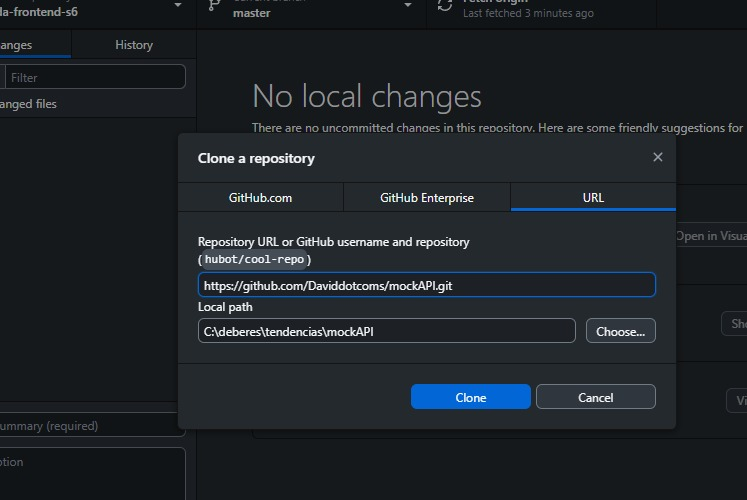
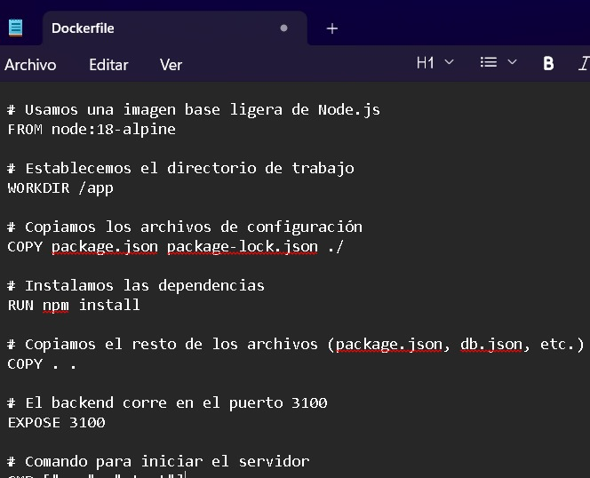
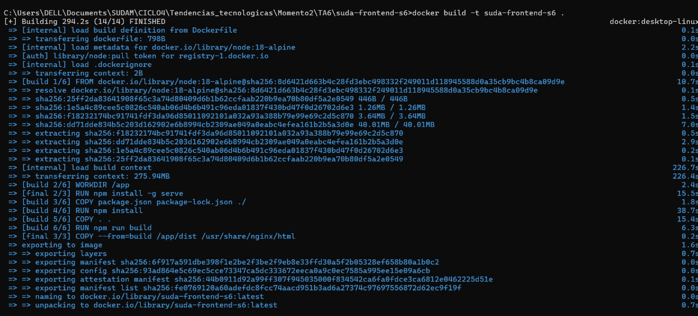
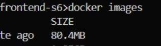
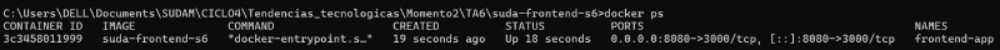
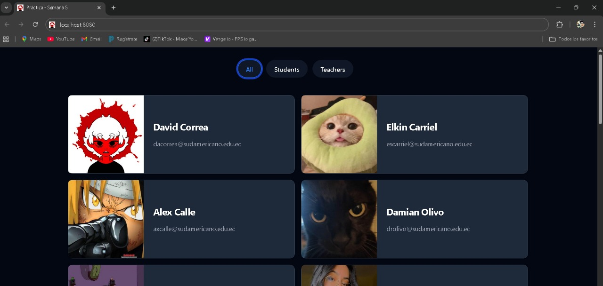
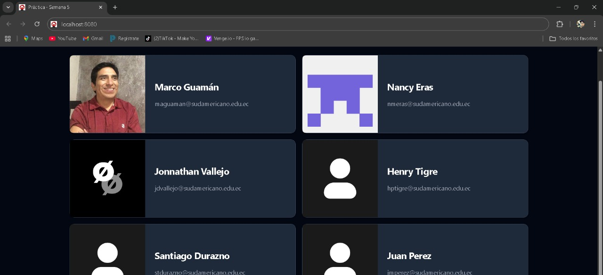

Práctica 6 – Creacion de imagen personalizada
1. Titulo
Creacion de imagen personalizada

2. Tiempo de duración
Tiempo utilizado: 50 minutos

3. Fundamentos:
La contenerización mediante Docker es una tecnología de virtualización a nivel de sistema operativo que permite empaquetar aplicaciones y todas sus dependencias en unidades ligeras y portables llamadas contenedores. Esto garantiza la consistencia del entorno de ejecución en cualquier fase del desarrollo. En esta práctica se emplearon dos herramientas clave (Pahl & Xiong, 2023):

Dockerfiles y Build Multi-Stage

Para el frontend (React), se utilizó una estrategia de Build Multi-Stage definida en el Dockerfile. Esta técnica se basa en utilizar una imagen base completa (node:18-alpine AS build) para compilar el código fuente y generar los archivos estáticos optimizados (npm run build). Posteriormente, estos artefactos se copian a una segunda imagen más pequeña (node:18-alpine AS final) que solo contiene lo necesario para servirlos (el módulo serve). Este proceso reduce drásticamente el tamaño final de la imagen, mejorando la seguridad y los tiempos de despliegue (Merkel, 2014).

Orquestación con Docker Compose

Cuando una aplicación requiere múltiples servicios interconectados (un frontend, un backend, una base de datos), se emplea un orquestador. Docker Compose permite definir y gestionar estos servicios a través de un único archivo docker-compose.yml. Compose crea una red interna por defecto donde los servicios pueden comunicarse utilizando sus nombres (ej., backend), lo cual elimina la necesidad de usar localhost para la comunicación entre contenedores. La correcta configuración del Host Binding (--host 0.0.0.0) y el manejo de CORS (Cross-Origin Resource Sharing) en el backend es esencial para que este sea accesible tanto por el frontend dentro de la red Docker como por el navegador del host

4. Conocimientos previos.

Para realizar esta práctica, debemos tener claro los siguientes temas:
-Comandos Linux/CMD: Navegación por directorios, manipulación de archivos.
-Manejo de Git y GitHub Desktop: Clonación de repositorios.
-Comandos Básicos de NPM: npm install, npm run dev.
-Sintaxis YAML: Para la correcta definición del archivo docker-compose.yml.
-Conceptos de Redes: Diferencia entre mapeo de puertos (ej. 8080:3000) y nombres de servicio internos (ej. http://backend:3100).

5. Objetivos a alcanzar
-Implementar contenedores optimizados para Frontend (React/Vite) y Backend (JSON-Server).
-Configurar la comunicación entre ambos servicios usando la red interna de Docker Compose.
-Establecer la configuración de CORS y Host Binding (0.0.0.0) en el backend para su accesibilidad.
-Crear la solución de contenedores utilizando un único archivo docker-compose.yml.
-Verificar la funcionalidad completa de la aplicación en el navegador del host.

6. Equipo necesario:
-Computador con sistema operativo Windows 10/11.
-Docker Desktop (versión 27.x o superior).
-Node.js y NPM (v18.x o superior).
-Cliente Git (Terminal o GitHub Desktop).
-Editor de Código (VS Code).

7. Material de apoyo.
-Documentación oficial de Docker: https://docs.docker.com/
-Documentación de json-server (Configuración de servidor custom).
-Guía de la asignatura de Servidores Web.
-Artículo sobre Build Multi-Stage en Docker.

8. Procedimiento

-Paso 1: Clonación y Preparación de Archivos

-Paso 2: Instalar dependencias y ejecutar el frontend localmente
Usamos npm install para las dependecias tanto para front como para back.

-Paso 3: Verificamos el back y front simulados.
Entraremos en http://localhost:3100 y http://localhost:5173/

-Paso 4: Crearemos el archivo Dockerfile

-Paso 5: Crear la imagen Docker

-Paso 6: Verificar que la imagen se creo correctamente

-Paso 7: Ejecutar el contenedor y verificamos que este en ejecucion
Ejecutamos el contenedor front con: docker run -d -p 8080:80 --name cont-react frontend-react:latest y verificamos con docker ps

-Paso 8: Verificar el funcionamiento desde el navegador

9. Resultados esperados:

Al finalizar la práctica, la aplicación es accesible en el puerto mapeado http://localhost:8080/. Se verifica el éxito de la contenerización y la orquestación:

-El Frontend (React, puerto 8080) se comunica con el Backend utilizando el nombre de servicio interno backend.

-La aplicación carga y muestra la lista de usuarios, confirmando la correcta conectividad del entorno orquestado.

<img src="img/si.jpg" width="800px" /

10. Bibliografía
Merkel, D. (2014). Docker: lightweight Linux containers for consistent development and deployment. Linux Journal, (239).

Pahl, C., & Xiong, H. (2023). A systematic review of containerization technologies: Security, performance, and trends. Journal of Systems and Software, 195, 111516.

Porto, G. P. (2018). Docker Compose: A practical guide to developing multi-container applications. Packt Publishing.
